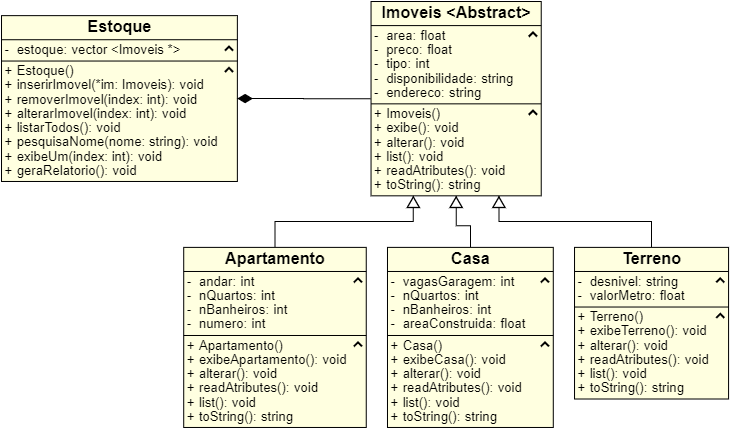

# Projeto CRUD - Tema: Imobiliaria

Sistema de controle de estoque de uma imobiliária feito para avaliar conhecimentos de Programação Orientada a Objetos em C++ na disciplina de Linguagem de Programação I.

Professores: Derzu Omaia e Marcelo Iury

### Diagrama de Classes
 